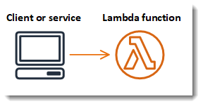

# AWS Lambda Java Sample App



Based on [the official sample app](https://github.com/awsdocs/aws-lambda-developer-guide/tree/main/sample-apps/java-basic).

The project source includes function code and supporting resources:
- `src/main` - A Java function.
- `pom.xml` - A Maven build file.
- `terraform` - IaaS to create a S3 bucket that contains the code and the lambda
- `1-create-bucket.sh`, `2-deploy.sh`, etc. - Shell scripts to deploy and manage the application.

Use the following instructions to deploy the sample application.

# Requirements
- [Java 8 runtime environment (SE JRE)](https://www.oracle.com/java/technologies/javase-downloads.html)
- [Maven 3](https://maven.apache.org/docs/history.html)
- The Bash shell. For Linux and macOS, this is included by default. In Windows 10, you can install the [Windows Subsystem for Linux](https://docs.microsoft.com/en-us/windows/wsl/install-win10) to get a Windows-integrated version of Ubuntu and Bash.
- [The AWS CLI](https://docs.aws.amazon.com/cli/latest/userguide/cli-chap-install.html) v1.17 or newer.
- [Terraform](https://developer.hashicorp.com/terraform/downloads) v1.2.6 or newer

If you use the AWS CLI v2, add the following to your [configuration file](https://docs.aws.amazon.com/cli/latest/userguide/cli-configure-files.html) (`~/.aws/config`):

```
cli_binary_format=raw-in-base64-out
```

This setting enables the AWS CLI v2 to load JSON events from a file, matching the v1 behavior.

# Setup

Configure your AWS credentials.

    $ aws configure

Download or clone this repository.

    $ git clone https://github.com/pauladj/aws-lambda-java-sample.git

To initialize terraform, run `1-initialize-terraform.sh`.

    aws-lambda-java-sample$ ./1-initialize-terraform.sh

# Deploy
To deploy the application, run `2-deploy.sh`.

    aws-lambda-java-sample$ ./2-deploy.sh

This script builds the jar using Maven and uses Terraform to deploy the S3 bucket, Lambda function and an IAM role. If the resources already exists, the script updates it with any changes to the function code.

# Test
To invoke the function, run `3-invoke.sh`.

    aws-lambda-java-sample$ ./3-invoke.sh
    {
        "StatusCode": 200,
    }
    "200 OK"

# Configure Handler Class

By default, the function uses a handler class named `Handler` that takes a map as input and returns a string. Other available handlers:

- `Handler.java` – Takes a `Map<String,String>` as input.
- `HandlerInteger.java` – Takes an `Integer` as input.
- `HandlerList.java` – Takes a `List<Integer>` as input.
- `HandlerDivide.java` – Takes a `List<Integer>` with two integers as input.
- `HandlerStream.java` – Takes an `InputStream` and `OutputStream` as input.
- `HandlerString.java` – Takes a `String` as input.
- `HandlerWeatherData.java` – Takes a custom type as input.

To use a different handler, change the value of the Handler setting in the application template (`template.yml` or `template-mvn.yaml`). For example, to use the list handler:

    Properties:
      CodeUri: build/distributions/java-basic.zip
      Handler: example.HandlerList

Deploy the change, and then use the invoke script to test the new configuration. For handlers, that don't take a JSON object as input, pass the type (`string`, `int` or `list`) as an argument to the invoke script.

    ./3-invoke.sh list
    {
        "StatusCode": 200,
        "ExecutedVersion": "$LATEST"
    }
    9979

# Cleanup
To delete the application and AWS resources, run `4-cleanup.sh`.

    aws-lambda-java-sample$ ./4-cleanup.sh
